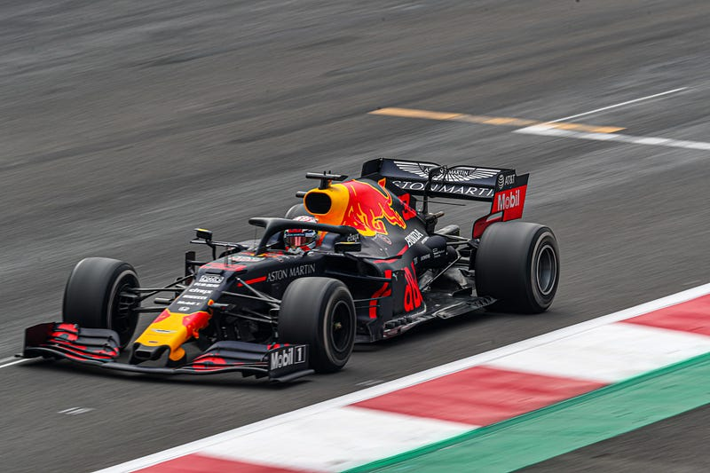
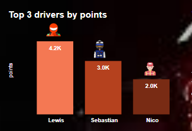
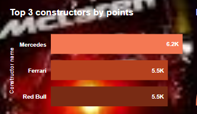
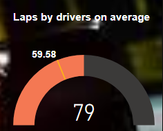
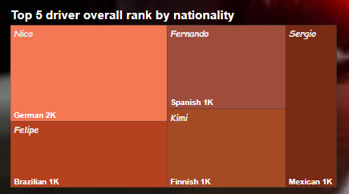
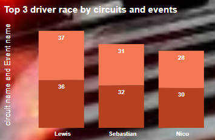
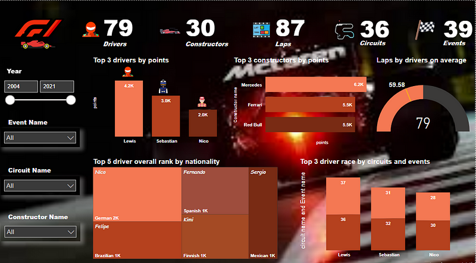

# Formula-1-F1-Data-Analysis

>*An Onyx Data and Astrato Analytics April Challenge*

## Introduction:

I participated in this month (April) online challenge hosted by Onyx Data and Astrato Analytics on **Formula 1 (F1)** motor racing.

    
#### What is Formula 1?

  **Formula 1®** is a racing sport of highest level of single-seat, open-wheel and open-cockpit professional motor racing contest which began in 1950 and is the world's most prestigious motor racing competition, as well as the world's most popular annual sporting series.
  
  
  
## Objective

The objective of this analysis is to identify the dominating drivers and constructors from 2004 to 2021.

## Steps taken before the Visualization;

>*Tool used is Power BI*

**Fetching the data:** The data was loaded into Power BI and was transformed for Cleaning.

**Data Cleaning and Wrangling:** I removed the empty data and errors present in the data and did some arrangement.
During the cleaning process I realized the data had some old events backed to 1950 but i wanted to focus on recent events and performances not the latter which bring our data to 2004 to 2021.

## Insights
>*After the Cleaning and Wrangling, the following are my Findings;*

From 2004 to 2021, 79 drivers participated in 39 events and 36 circuits with 30 constructors covering 87 laps.

In my analysis I limited the insights of the dominating drivers by points to the Top three (3) only which put Lewis in the First Position, followed by Sebastian and Nico with 4.2k, 3k and 2k points respectively.

Further findings showed that Mercedes, Ferrari and Red Bull are the Top three (3) constructors by points with 6.2k, 5.5k and 5.5k points respectively.

On average, the drivers were able to complete a total of 59.58 laps in the Formula1 (F1) race.

An overall rank analysis was done by nationality limiting it to the Top five (5) drivers only putting Nico (German) with the overall rank points of 2k leaving Felipe (Brazillian), Fernando (Spanish), Kimi (Finnish) and Sergio (Mexican) at 1k points each.

Analysis was also conducted by events and circuits showing how many events and circuits the Top three (3) drivers were able to complete.

Lewis who is the dominating driver with 4.2k points was able to complete 36 circuits and 37 events while Sebastian who is on the 2nd position by points was able to complete 32 circuits and 31 events which puts Nico on the 3rd position by points with 30 circuits and 28 events completed.

## Dashboard

## Conclusions

To be honest, prior to this challenge I have no knowledge about Formula1 (F1) but it was really an eye opener to this type of sport and i must say that i enjoyed every process of the analysis and did my best not to go out of the objectives of the analysis.

So, there you have it. Lewis, Sebastian and Nico are the Top three dominating drivers and Mercedes, Ferrari and Red bull are the Top three dominating constructors.

>*Mission Accomplished*

## Credits

* Astrato Analytics and Onyx Data
* Linkedin

## Tools

* Power Bi

## Contacts and other projects

[Click here](https://ay43.github.io/#work)
